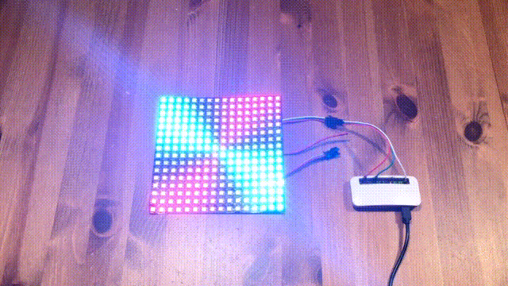
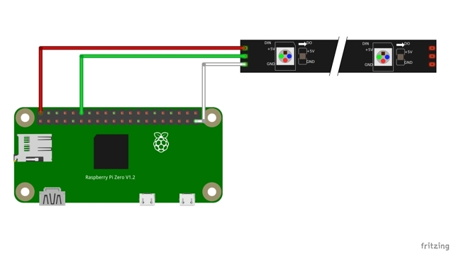
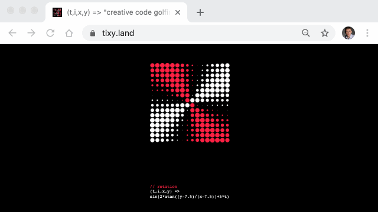
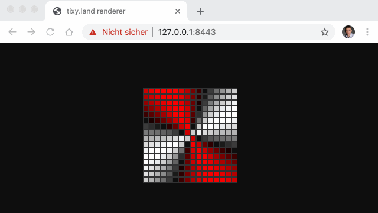
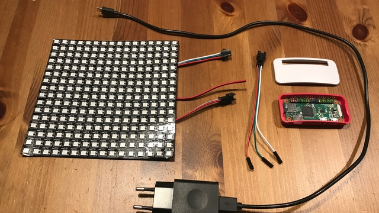
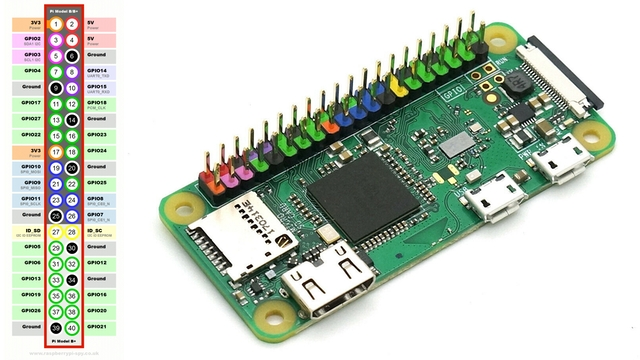
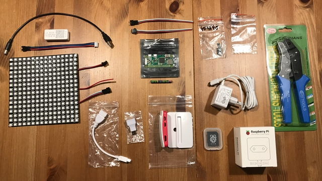

# rpi-ws281x-tixy

rpi-ws281x-tixy is a [tixy.land] renderer using a 16x16 WS2812B LED Matrix and a Raspberry PI (Zero W).

**> as this is a tinker project, we do not guarantee that it will work as expected or that no damage will occur <**

## Table of Contents  
* [Setup and Run](#setup-and-run) 
* [Background](#background)
* [HowTo](#howto)
  * [LED Renderer](#led-renderer)
  * [Web Renderer](#web-renderer)
  * [Minimal setup](#minimal-setup)
  * [Shopping cart](#shopping-cart)
* [Credits](#credits)


## Setup and Run



Provided you hava a 16x16 WS2812B LED Matrix and a recent Raspberry PI or PI Zero, connect the three wires to the PI`s GPIO Pins like this:

* Power or PWR (red) to Pin 2 (+5V)
* Data IN or DIN (green) to Pin 12 (GPIO 18)
* Ground or GND )white) to Pin 39



For the proof of concept, it seemed legit to make the following changes to a plain Raspberry PI OS (Lite or Desktop) release 2020/02/12 with kernel 5.4

* add this line ```blacklist snd_bcm2835``` to /etc/modprobe.d/snd-blacklist.conf
* add or uncomment ```hdmi_force_hotplug=1``` and ```hdmi_force_edid_audio=1```to /boot/config.txt

To install npm and node and all of their dependencies, one can just `sudo apt get install node npm`. Because latest offcial node.js packages for the PI Zero is v10.2, only and because of the long startup latency (that comes from the v8 engine), we upgraded to [latest unofficial node build] v15.5.0 following this [latest node on pi] tutorial.

Finally you can clone this repo, install the dependencies and run with root privileges.

```shell
git clone https://github.com/matths/rpi-ws281x-tixy
npm install
sudo node src/led.mjs
```

## Background



Beginning of November, @aemkei published [tixy.land], a 16x16 matrix of white and red dots, whose color and size is calculated from a short mathematical formula or pure function ```(t, i, x, y) => v``` which receives four parameters: time, index, x- and y-coordinates and returns a value between -1 (red) to 1 (white).

Immediately after a lot of people responded with a lot of creative functions, but also with different renderers, ports to different languages and a lot more. If you're interested I would encourage you to have a look at the [initial tixy tweet].

## Howto

### LED Renderer

Luckily there's already a library [beyondscreen/node-rpi-ws281x-native] to render an array of 24bit per pixel values on a series of WS2812B LEDs, no matter if they are in a row or form a matrix. It's a node port/binding of [jgarff/rpi_ws281x] by @usefulthink.

Thus we can use [index mapping] to match this tixy index parameter i to the correct LED. We also noticed, that the color values were recognized as GRB instead of RGB color values, so we tried to use the [beforeRender event] to switch green and red colors.
And because we can't control LED light size, we introduced a transformation to create shades between white and black or red and black.

### Web renderer



If you want to play with this and don't want do all changes directly on your PI, we added a div based web renderer as well. We use esm modules and thus rollup to bundle it. You can play with it like this:

```shell
cd server/ssl; ./create.sh; cd ../..
npm run dev
# open https://127.0.0.1:8443 in your browser
```

### Minimal setup

In current time you can easily order a flexible LED Panel Matrix with WS2812B LED at your favorite shopping platform directly from Shenzhen/China or Hong Kong. Ours came with 3 Pin JST-SM connectors, female for Data In (DIN) and male für Data Out (DOUT). So we needed to get a 3 Pin JST SM male connector and attach 3 single point female Dupont connectors to the other side to make a connection with the GPIO Pins from our PI Zero.

Keep an eye on the cable cross section, to make your adapter work with both connector types. We used cables between AWG 22 (best for JST) and AWG 28 (best for Dupont).



When you first buy a PI Zero be aware that the Pin Socket comes loose. So you need to solder it to the PI board. If soldering isn't yours, your can order a so called GPIO Hammer Header which doesn't need soldering.
On the other hand the PI Zero is often sold bundled with a colorful Pin Socket which matches the legend provided, whichs helps a lot to identify the needed Pins.




If you already have or bought a Raspberry PI make sure it is remotely available using e.g. SSH, so you don't need a screen, keyboard or mouse connected to control you PI.

### Shopping cart




To do this project on your own, you'll most probably need a subset or all of these items:

* flexible 16x16 WS2812B LED Panel with 3 Pin JST-SM socket
* 3 Pin JST-SM plug with premounted wires
* female Dupont plugs and crimp tool
* Raspberry PI, e.g. Zero
* PI housing (optional)
* GPIO Pin socket (needs soldering)
* or a GPIO Hammer Header (no soldering required)
* a ~2.5A or more micro-USB power supply
* micro SD card with Raspberry PI OS (Installer)
* Mini HDMI (type C) plug to HDMI (type A) socket adapter to drive a screen or TV
* Micro USB 2.0 (type B) plug to Standard USB 2.0 (type A) socket

## Credits
* @aemkei for [tixy.land]
* @usefulthink for the node library [beyondscreen/node-rpi-ws281x-native]
* Phillip for soldering our Pin header to our PI Zero


[latest node on pi]: https://yatil.net/posts/2020/11/07/node-on-pi/
[latest unofficial node build]: https://unofficial-builds.nodejs.org/download/release/v15.5.0/
[tixy.land]: https://www.tixy.land
[initial tixy tweet]:https://twitter.com/aemkei/status/1323399877611708416
[beyondscreen/node-rpi-ws281x-native]:https://github.com/beyondscreen/node-rpi-ws281x-native
[jgarff/rpi_ws281x]:https://github.com/jgarff/rpi_ws281x
[index mapping]:https://github.com/beyondscreen/node-rpi-ws281x-native#index-mapping
[beforeRender event]:https://github.com/beyondscreen/node-rpi-ws281x-native#events
